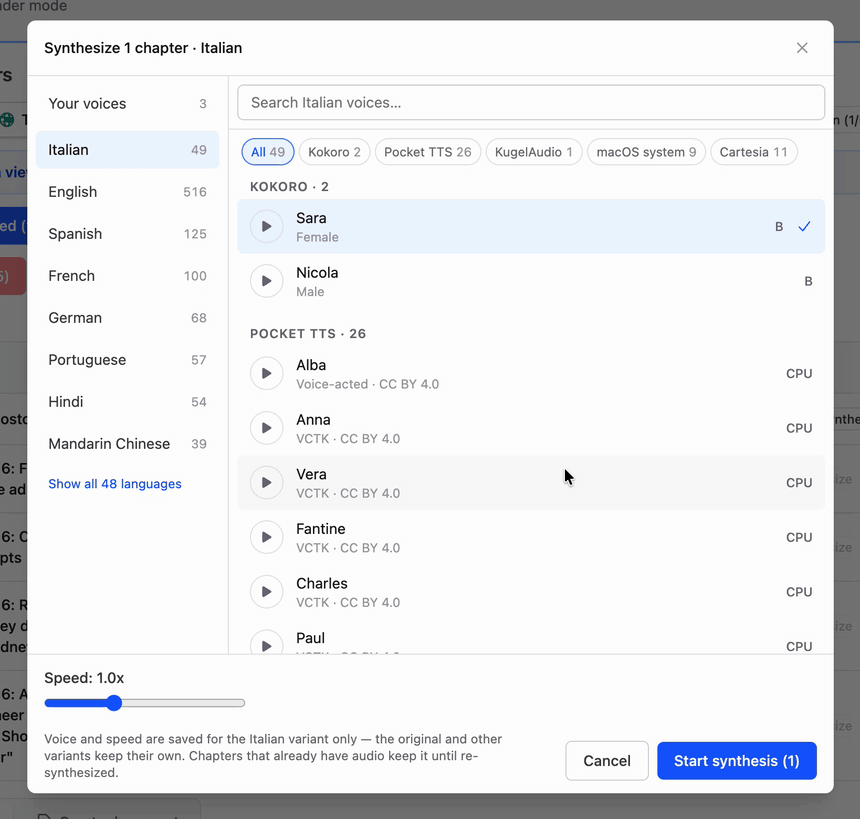
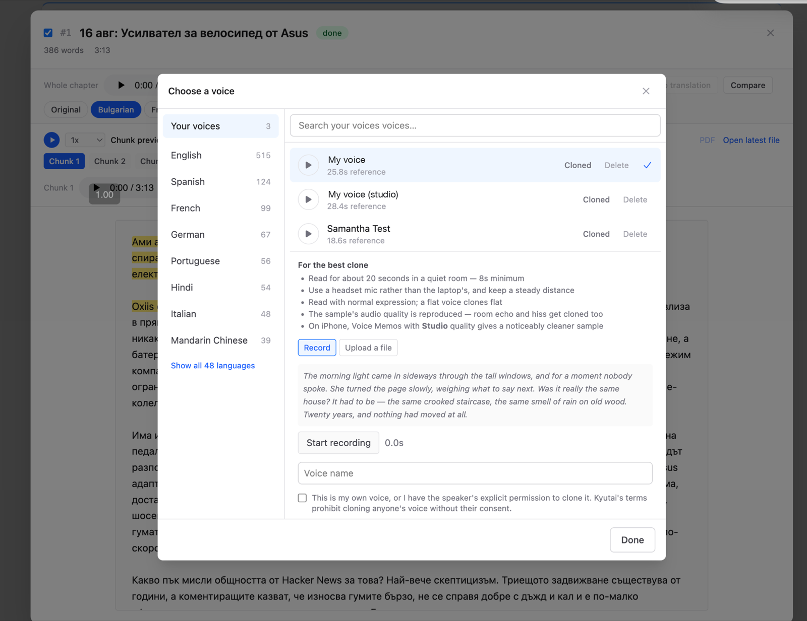

# pdf2audio

Turns PDF books into audiobooks — and more. Upload PDFs, pick a voice, and get chapter-marked M4B audiobooks, AI digests, translations, AI rewrites (ELI5, summaries, custom prompts), PDF/EPUB exports, and read-along synced EPUBs (audio + highlighted text) you can listen to offline on a phone.

Built for local use on Apple Silicon Macs. Fully offline after the initial model downloads (AI features need a DeepSeek API key).

## Intro videos

Short standalone tours, narrated by the app's own synthesized voice — the script is a book inside the app, playing on the right while the demo runs on the left.

| [](https://youtu.be/OKMiox3nxPY) | [](https://youtu.be/GhQW_Ma2qwI) |
| :--: | :--: |
| **[1 · The core idea](https://youtu.be/OKMiox3nxPY)**<br>PDF in, chapter-marked audiobook out | **[2 · Smart features](https://youtu.be/GhQW_Ma2qwI)**<br>Ask AI, chat with citations, translate & transform |
| [](https://youtu.be/g9kX_cNFD6k) | [](https://youtu.be/os3-bJxDhsM) |
| **[3 · Scaling your library](https://youtu.be/g9kX_cNFD6k)**<br>Instant indexing, library-wide chat, digests | **[4 · Documents and read-along](https://youtu.be/os3-bJxDhsM)**<br>PDF/EPUB export, synced read-along for your phone |
| [](https://youtu.be/fmIiWdthnfg) | |
| **[5 · Extensions and the road ahead](https://youtu.be/fmIiWdthnfg)**<br>The JSON API, scripted audiobooks, what's next | |

## What it does

- **PDF → audiobook**: chapter detection (deterministic tiers + optional LLM TOC detection), per-chapter TTS synthesis, single M4B assembly with native chapter markers and cover.
- **Raw-first uploads**: every upload gets instant `pdftotext` raw text; the slow Marker extraction (OCR-capable) is opt-in and can run later.
- **Per-chapter control**: edit text, re-synthesize, include/exclude, suspend/queue, AI cleanup of OCR artifacts, manual or LLM-proposed chapter boundaries.
- **Translations & transforms**: first-class per-chapter variants (DeepSeek) with their own TTS audio and assemblies; the original text is always preserved. A variant is either a translation (per language) or a rewrite — ELI5, shortened, summary, enriched-with-examples presets, or any custom prompt. Generation streams live into the side-by-side view, token by token (model reasoning is off by default for speed — a Reasoning checkbox turns it on and streams the thinking too).
- **Ask AI + notes**: whole-book or per-chapter prompts; every answer is auto-saved as a note on the book, and any note can be appended to the book as a chapter of its own — ready to reorder and synthesize.
- **Digest books**: select N books → one synthetic book with an AI summary chapter per source, ready to synthesize.
- **External API**: plain JSON endpoints (`POST /api/books`, see `docs/synthetic-books-api.md`) so scripts and other projects can create synthetic books and chapters — with optional straight-to-audio synthesis. Ships with `scripts/hn-top10.mjs`, which turns any day's top Hacker News stories (via hckrnews.com archives) into a podcast-style book — one chapter per story in an American network-news register (anchor slug with the day and that day's rank, hook, headline reveal), article text extracted with Defuddle, community reaction capped at 20%.
- **Document export**: selected chapters as PDF/EPUB (Vivliostyle), or as a **synced EPUB** — EPUB 3 with Media Overlays: embedded audio plus sentence-level highlighted text, valid per epubcheck.
- **Read-along on iPhone**: a self-hosted [Storyteller](https://storyteller-platform.dev/) companion (see `storyteller/`) auto-imports synced EPUBs; the free Storyteller Reader app downloads them for fully offline listening with live text highlighting.
- **Library organization**: nested folders with drag & drop, cross-folder search, lightweight profiles (workspaces) so different people keep separate libraries.
- **Library chat**: an agentic assistant (`/chat`) that searches the *content* of every book — hybrid full-text + semantic search (local BGE-M3 embeddings, cross-language: ask in English, find the Bulgarian passage and vice versa) — and streams answers with verified citations. Click a source chip to open the PDF at that page, the chapter, or the translation view. Answers can be saved as notes.

## How is this different from Ebook2Audiobook?

[Ebook2Audiobook](https://github.com/DrewThomasson/ebook2audiobook) is a one-shot converter: file in, audiobook out, with voice cloning (XTTSv2) and huge language coverage. pdf2audio is a **library you live in**: books persist in a database with per-chapter editing, re-synthesis, AI cleanup, translations and rewrites, notes, digests, read-along export, and chat over the content of every book. PDFs are the first-class input (raw text instantly, OCR opt-in) rather than routed through an EPUB conversion, and the TTS stack is newer local models (Kokoro, KugelAudio) plus macOS and Cartesia voices instead of the Coqui-era engines. If you want "this EPUB in a cloned voice", use Ebook2Audiobook; if you want to clean up, restructure, transform, and actually work with a messy PDF collection, that's this.

## How it works

```
Upload → rawExtract (pdftotext, seconds, always)
       → extract (Marker, opt-in, OCR-capable) → normalize → synthesize (TTS) → assemble → M4B
       → translate/transform → synthesizeTranslation → per-variant assembly
       → assembleDocument → PDF / EPUB / synced EPUB
```

Jobs run through [Graphile Worker](https://github.com/graphile/worker) in six pools (TTS, raw text, extraction, assembly, AI/translation, search indexing) with `maxAttempts: 1` — nothing retries silently; the user reviews failures and decides. Chapter text falls back `customText ?? cleanText ?? rawText` at synthesis time.

TTS engines (see [Languages](#languages) for what covers what): [Kokoro](https://huggingface.co/hexgrad/Kokoro-82M) (English, French, Spanish, Italian, Brazilian Portuguese, Hindi, Mandarin), KugelAudio (24 EU languages incl. Bulgarian, local 4-bit MLX quant), BG-TTS V5 MLX, and Meta MMS Bulgarian — all local, GPU-accelerated via MPS/Metal. Plus [Pocket TTS](https://github.com/kyutai-labs/pocket-tts) from Kyutai (100M params, **CPU-only** at ~12x realtime, 26 built-in voices, optional voice cloning from a ~20s sample), every installed macOS system voice (via `say`, free and ~25x realtime), and optional [Cartesia](https://cartesia.ai) Sonic cloud TTS (`CARTESIA_API_KEY`).

During synthesis the server keeps a per-chunk text↔audio timing map (`chNNN.sync.json`) next to each chapter's M4A. That map powers the web UI's read-along player and the synced EPUB export — and once it is written, the worker deletes the intermediate chunk WAVs to reclaim disk (`pnpm --filter server cleanup:chunks` sweeps leftovers from older runs).

### Languages

Every engine covers a different set, so the answer to "does it do language X" depends on which one you pick. Local engines, unless noted:

| Language | Voices | Engine |
| --- | --- | --- |
| English | 27 + 26 | Kokoro, Pocket TTS |
| Spanish, Italian, German, Portuguese, French | 26 each | Pocket TTS (downloadable from the picker) |
| Bulgarian | 3 + system | BG-TTS V5 MLX, MMS Bulgarian, KugelAudio, macOS `Daria` |
| French, Spanish, Italian, Brazilian Portuguese | 2 each | Kokoro |
| Hindi | 4 | Kokoro |
| Mandarin Chinese | 8 | Kokoro |
| 24 EU languages | 1 multilingual narrator | KugelAudio (opt-in ~5 GB download) |
| Most others | many | [Cartesia](https://cartesia.ai) (cloud, needs an API key), plus any macOS system voice you have installed |



The picker leads with the language, not the engine: pick Italian and you get every voice that can read it — 49 here, grouped by engine, with a preview button on each one.

Notes on the edges:

- **Japanese is not supported**, even though Kokoro ships Japanese voices. They need a MeCab/`fugashi`
  native stack plus a ~700 MB dictionary, and the extra downgrades a package the Marker/spaCy side
  depends on. Not worth it for five voices — so they aren't listed in the picker.
- **Pocket TTS ships one checkpoint per language**, and only English is installed by `pnpm run setup`.
  The others download on demand: open the picker's Pocket TTS tab, pick a language, and press
  Download — it shows the size first (~370 MB each, **~800 MB for French**, which has no distilled
  build yet and runs ~2.5x slower). Downloads land in the shared HuggingFace cache and go live
  immediately; no server restart.
- **Pick the matching language.** The English model will happily read French or Italian text and
  produce something that sounds plausible, because the voices include non-English *speakers*
  (Giovanni, Lola, Juergen, Rafael, Estelle). It mispronounces silent letters and liaisons — the
  same French sentence runs 25% longer on the English model than the French one. Selecting the
  language is what makes it correct, not selecting a native-sounding voice.
- Mandarin needs the `misaki[zh]` G2P chain, which `scripts/requirements.txt` pins and
  `pnpm run setup` installs.

## Project structure

pnpm monorepo: `packages/server` (Fastify + tRPC + Graphile Worker + Drizzle/Postgres, port 3034) and `packages/web` (React 19 + Vite + Tailwind v4 + react-router 7, port 3033). Python TTS/extraction scripts live in `scripts/`; the optional Storyteller companion in `storyteller/`.

**The detailed, maintained map of files, tables, routes, and pipeline internals is in [AGENTS.md](AGENTS.md)** — this README stays intentionally high-level.

## Database

PostgreSQL 17 with pgvector in Docker (`pgvector/pgvector:pg17`, host port **5433**), schema via Drizzle ORM: `profiles`, `folders`, `books`, `book_files`, `chapters`, `chapter_translations`, `assemblies`, `documents`, `notes`, `book_logs`, `book_chunks` (search index: FTS + embeddings). See AGENTS.md for column-level docs. Migrations: `pnpm db:generate` + `pnpm db:migrate`.

### One-time migration from the old `postgres:17-alpine` image (2026-08)

The compose file switched from `postgres:17-alpine` to `pgvector/pgvector:pg17` (needed for the `vector` extension). The images use different C libraries (musl vs glibc), so the data volume is **not** reused — the compose volume was renamed `pgdata` → `pgdata17` and data moves via dump/restore:

```bash
# 1. While still on the old container:
docker compose exec postgres pg_dump -U pdf2audio --no-owner pdf2audio > pgbackup.sql
# 2. Pull up the new image + fresh volume (compose file already updated):
docker compose up -d
# 3. Restore:
docker compose exec -T postgres psql -U pdf2audio -d pdf2audio < pgbackup.sql
# 4. Verify the app, then eventually: docker volume rm pdf2audio_pgdata
```

The old `pdf2audio_pgdata` volume stays untouched as a rollback until you delete it.

After the restore, index the library for search: `pnpm db:migrate && pnpm backfill:index` (FTS is available within minutes; BGE-M3 embeddings fill in as a background pass).

## File storage

All runtime data lives in `./data/` (gitignored, resolved relative to `packages/server`):

```
data/uploads/{bookId}/            Uploaded PDFs
data/tmp/{bookId}/                Marker JSON output
data/output/{bookId}/             Chapter M4As + sync maps, M4B assemblies, exported documents
data/output/{bookId}/{slug}/      Variant audio (language or transform slug)
data/output/{bookId}/chunks/      Chunk WAV previews (disposable once sync maps exist)
data/previews/                    Voice preview M4As
```

## Prerequisites

An Apple Silicon Mac (the MLX TTS engines need Metal) with:

- [Homebrew](https://brew.sh), then: `brew install ffmpeg poppler espeak-ng python@3.12 node pnpm`
- Docker — [OrbStack](https://orbstack.dev/) or Docker Desktop (for Postgres and optionally Storyteller; fine to install while setup downloads models — the setup script prints the two commands to finish the database step)
- Optional: a [DeepSeek](https://platform.deepseek.com/) API key for translation, rewrites, cleanup, digests, Ask AI, and LLM chapter detection
- Optional: a [Cartesia](https://cartesia.ai) API key for the Sonic cloud TTS voices
- Optional: a [HuggingFace](https://huggingface.co) account for Pocket TTS **voice cloning** — accept the terms at
  [kyutai/pocket-tts](https://huggingface.co/kyutai/pocket-tts) and put a read token in `HF_TOKEN`. The 26 built-in
  Pocket TTS voices need no account and no token.

## Setup

```bash
git clone https://github.com/subev/pdf2audio.git && cd pdf2audio
pnpm run setup    # checks deps, builds .venv (pinned Python deps), caches models, starts Postgres, migrates
pnpm dev          # server on :3034, web on :3033
```

`pnpm run setup` is idempotent — rerun it after failures. (Note: it must be `pnpm run setup`; bare `pnpm setup` triggers pnpm's unrelated builtin.) It creates `.env` with working defaults and skips the ~17 GB KugelAudio narrator download unless you answer yes (or run `pnpm run setup --kugel`). Python packages install into a repo-local `.venv` from `scripts/requirements.txt` (pinned to a known-good set; point `CONDA_ENV_PATH` in `.env` at another env's `bin` dir if you manage your own). Add `DEEPSEEK_API_KEY` to `.env` for the AI features.

### Optional: Storyteller companion (read-along on a phone)

```bash
cd storyteller
openssl rand -base64 32 > STORYTELLER_SECRET_KEY.txt
docker compose up -d          # web UI + API on http://localhost:8001
```

Create the admin account at `http://localhost:8001`, then set `READALOUD_DROP_DIR=<repo>/storyteller/data/import` in `.env` — the "Copy to Storyteller import folder" checkbox on synced-EPUB exports will drop files there and Storyteller auto-imports them. Install the free **Storyteller Reader** iOS/Android app and point it at your Mac's LAN address on port 8001.

## Development commands

```bash
pnpm dev              # Start server + web in parallel
pnpm dev:server       # Server only (port 3034)
pnpm dev:web          # Web only (port 3033)
pnpm db:up            # Start Postgres in Docker
pnpm db:down          # Stop Postgres
pnpm db:generate      # Generate Drizzle migration from schema changes
pnpm db:migrate       # Apply migrations
pnpm run setup        # Full setup (deps check, .venv + pinned Python deps, model caching, Postgres + migrations)
pnpm jobs             # Show Graphile Worker queue status
pnpm jobs:clear       # Delete all queued jobs
cd packages/server && pnpm test   # Server test suite (spins up template DB, runs migrations)
```

## Notes

- Docker Postgres is mapped to host port **5433** to avoid conflicts with other Postgres instances on 5432.
- Every TTS/extraction subprocess runs with `HF_HUB_OFFLINE=1`, so models never download at synthesis time — `pnpm run setup` caches them all up front (Kokoro-82M, Marker/Surya, BG-TTS V5, MMS Bulgarian, BGE-M3).
- The first PDF/EPUB export downloads a rendering browser (~350 MB) into the Vivliostyle cache.
- **Pocket TTS** runs in its own Python env (`.venv-pocket`) because it needs numpy 2.x while the marker/kokoro stack is pinned to 1.26. `pnpm run setup` builds both. It is CPU-only by design — it leaves the GPU free for the MLX engines — and has no speed parameter, so the UI disables the slider.
- **Pocket TTS voice licensing is mixed.** The built-in voices are embeddings of real recordings under different licenses: most are CC0 or CC BY 4.0, but `cosette` and `jean` are **CC BY-NC 4.0 (non-commercial only)** and `estelle`'s provenance is unverified. Each voice shows its license in the picker. This is irrelevant while pdf2audio is noncommercial (see [LICENSE](LICENSE)) — it matters if you ever sell audio made with it. Details in [docs/tts-licensing.md](docs/tts-licensing.md).
- The Bulgarian-capable narrators are `BG-TTS V5 (Radi Totev MLX port)`, `MMS Bulgarian (Meta)`, `KugelAudio (7B, 24 EU languages)`, the macOS `Daria` system voice, and Cartesia's Bulgarian voices. The local model narrators run at fixed speed (UI disables the slider); macOS and Cartesia voices support the speed control.
- KugelAudio (`kugelaudio/kugelaudio-0-open`, Apache-2.0) runs from a local 4-bit MLX quantization (~5 GB) at `~/.cache/pdf2audio-models/kugelaudio-0-open-4bit` (override with `KUGEL_TTS_MODEL_PATH`); `pnpm run setup --kugel` downloads and converts it. ~1.5x realtime on an M4 Pro.
- `facebook/mms-tts-bul` is licensed `CC-BY-NC-4.0`.
- Best Kokoro voices: `af_heart` (A tier), `af_bella` (A- tier), `bf_emma` (B- tier).

### Book language

Books carry an optional language, set from **Extract... → About this book**. It's a plain field you pick
yourself — nothing infers it — and it decides which voices the picker offers first, so a Russian PDF
opens on Russian voices instead of English ones. Leave it unset and the picker falls back to the
language of whatever voice is currently selected.

### Cloning your own voice

Pocket TTS can clone a voice from a short sample. In the voice picker, open **Your voices**, then either record ~20 seconds in the browser or upload a file (anything ffmpeg can read). The sample is encoded locally into a small voice file and the recording is discarded — it never leaves the machine running pdf2audio.



**Set your expectations accordingly.** Pocket TTS is a 100M-parameter model built to run on a CPU, and a clone inherits that ceiling — it lands somewhere between recognisable and convincing, and it is not as easy to listen to across a whole book as Kokoro's built-in voices. It also reproduces the *recording* faithfully, so room echo and mic hiss get cloned along with the voice. A quiet room and a headset mic help; on iPhone, Voice Memos set to **Studio** quality gives a noticeably cleaner sample. It's a fun extra rather than the voice you'd pick for a long listen.

Kyutai's terms prohibit cloning a voice without that person's consent, along with deception and impersonation generally — hence the confirmation checkbox, which the server enforces rather than takes on trust. Enabling cloning means accepting those terms on your own HuggingFace account, and if you host pdf2audio for other people, enforcing them becomes your responsibility.

## License

[PolyForm Noncommercial 1.0.0](LICENSE.md) — the source is public, and you're free to use, modify, and share pdf2audio for personal and any other noncommercial purpose. Commercial use of any kind requires permission — open a GitHub issue to ask.
